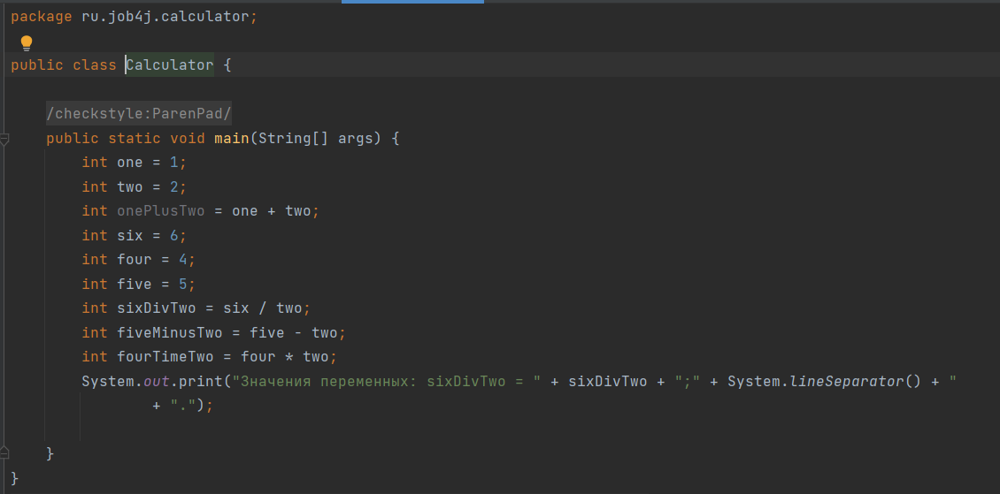
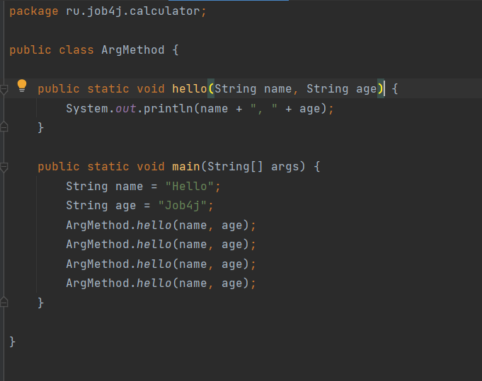

# job4j
### _Проект содержит решения блока "Базовый синтаксис" курса Job4j._

    О проекте. В этом проекте я учусь основам языка программирования Java.
    В этом проекте рассмотрены:
- основы работы с Git;
- переменные;
  

- арифметические операции;
- методы;

  

- работа с аргументами метода;
- операторы ветвления;
- циклы;
- массивы;
- модульное тестирование;
- IDEA.

Учусь использовать инструмент сборки Maven. 

### Контакты: 
### _Мой GIT: https://github.com/kai-73_
### _Мой Telegram: @oromankzn_
#### Со мною Вы можете связаться одним из вышеперечисленных способов.

 
